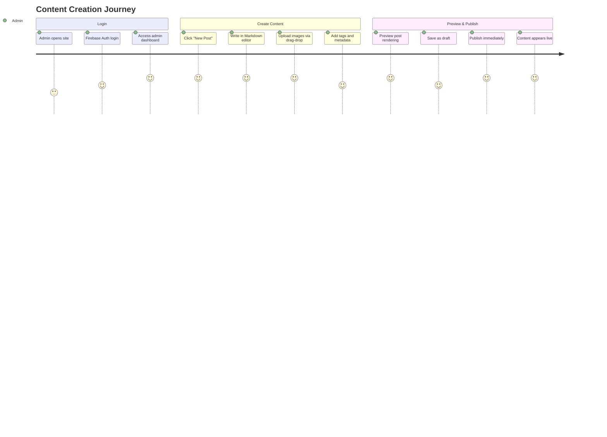
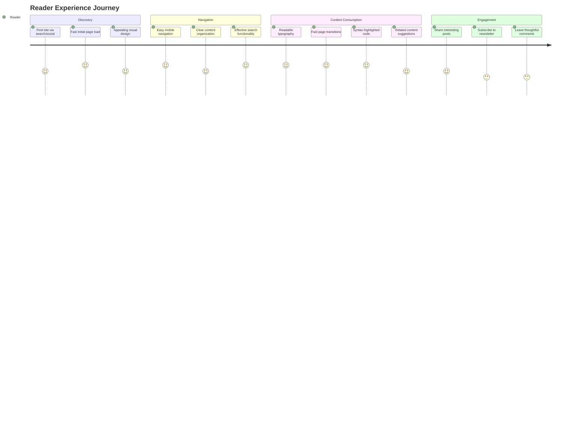

# Product Context: Personal Blog

## Vision & Purpose

### **Why This Project Exists**

A personal blog platform designed to showcase technical thoughts, projects, and professional insights while serving as a portfolio and knowledge-sharing hub. The blog aims to demonstrate both technical expertise and content creation skills in the software development space.

### **Core Problems It Solves**

#### **For the Creator (Primary User)**

1. **Content Management Scalability**: Need for easy, efficient content creation without technical barriers
2. **Professional Presence**: Showcase technical skills and thought leadership
3. **Portfolio Integration**: Seamlessly display projects alongside written content
4. **Content Ownership**: Full control over content and platform without third-party limitations

#### **For Readers (Secondary Users)**

1. **Technical Knowledge Access**: High-quality, well-organized technical content
2. **Project Discovery**: Ability to explore and understand technical projects
3. **Professional Insights**: Access to real-world development experiences and learnings
4. **User Experience**: Fast, accessible, mobile-friendly reading experience

## Product Goals & Objectives

### **Primary Goals**

#### **Content Creation Excellence**

- **Efficient Publishing**: Reduce content creation time from hours to minutes
- **Rich Content Support**: Markdown formatting, code highlighting, image integration
- **Professional Presentation**: Clean, readable formatting that showcases content quality

#### **Technical Showcase**

- **Project Portfolio**: Comprehensive display of technical projects with live demos
- **Code Examples**: Syntax-highlighted code blocks and technical explanations
- **Architecture Discussions**: Deep dives into technical decisions and patterns

#### **User Experience Leadership**

- **Mobile-First Design**: Exceptional experience across all device types
- **Performance Excellence**: Sub-2-second load times, 90+ Lighthouse scores
- **Accessibility Standards**: WCAG 2.1 AA compliance for inclusive access

### **Secondary Goals**

#### **Community Engagement**

- **Content Discovery**: Search and filtering to help users find relevant content
- **Social Sharing**: Easy sharing of valuable content across platforms
- **Reader Feedback**: Comment system for community discussion

#### **Professional Development**

- **SEO Optimization**: Improved visibility for technical content
- **Analytics Insights**: Understanding audience engagement and content performance
- **Newsletter Integration**: Direct communication channel with interested readers

## User Experience Vision

### **Content Creator Experience (Admin)**

#### **Current Pain Points (To Be Solved)**

- **Content Creation**: Editing TypeScript files is inefficient and error-prone
- **Image Management**: Manual file handling and optimization is time-consuming
- **Publishing Workflow**: No clear draft/publish workflow or content scheduling

#### **Ideal Experience (Target State)**



#### **Success Metrics**

- **Time to Publish**: < 5 minutes from idea to live post
- **Error Rate**: Zero technical errors during content creation
- **User Satisfaction**: Admin can focus on writing, not technical details

### **Reader Experience (Primary Audience)**

#### **Target Audience Profile**

- **Primary**: Software developers, technical professionals, hiring managers
- **Secondary**: Students, career changers, fellow content creators
- **Tertiary**: General tech enthusiasts and professionals in adjacent fields

#### **Current Experience Issues (To Be Fixed)**

- **Mobile Experience**: "Really really bad" - navigation and readability issues
- **Content Discovery**: No search functionality makes finding specific content difficult
- **Performance**: Load times and responsiveness need improvement

#### **Ideal Reader Journey**



#### **Success Metrics**

- **Mobile Experience**: Smooth navigation and readable content on all devices
- **Search Success**: Users find relevant content in < 30 seconds
- **Engagement**: Increased time on site and return visits

## Product Features & Functionality

### **Core Features (Must-Have)**

#### **Content Management System**

```typescript
// Content creation workflow
interface BlogPostCreation {
  title: string;
  slug: string; // Auto-generated from title
  excerpt: string;
  content: string; // Markdown format
  coverImage: File | null;
  tags: string[];
  published: boolean;
  scheduledDate?: Date;
}
```

**Key Capabilities**:

- **Markdown Editor**: Rich editing experience with live preview
- **Image Upload**: Drag-and-drop with automatic optimization
- **Tag Management**: Create, edit, and organize content tags
- **Draft/Publish Workflow**: Save drafts and publish when ready

#### **Content Display System**

- **Unified ContentCard Component**: Consistent presentation across all content types
- **Responsive Grid Layouts**: Optimized for different screen sizes and content types
- **Syntax Highlighting**: Beautiful code presentation with proper language detection
- **Tag-Based Organization**: Filter and discover content by topic

#### **Search & Discovery**

- **Client-Side Search**: Fast search across all content without server requests
- **Multi-Field Search**: Search titles, excerpts, content, and tags
- **Search Results Highlighting**: Visual emphasis on matching terms
- **Filter Options**: Combine search with tag-based filtering

### **Enhanced Features (Should-Have)**

#### **User Engagement**

- **Comments System**: Anonymous comments with moderation capabilities
- **Social Sharing**: One-click sharing to major platforms
- **Newsletter Subscription**: Automated content distribution
- **RSS Feed**: Standard syndication for feed readers

#### **Performance & SEO**

- **Image Optimization**: Automatic compression and WebP conversion
- **Code Splitting**: Lazy loading for improved performance
- **Meta Tag Management**: Dynamic SEO optimization per post
- **Structured Data**: Rich snippets for search engines

#### **Analytics & Insights**

- **Google Analytics Integration**: Comprehensive visitor and engagement tracking
- **Popular Content Tracking**: Identify most-read posts and topics
- **Search Analytics**: Understand what users are looking for
- **Performance Monitoring**: Track site speed and user experience metrics

### **Future Features (Nice-to-Have)**

#### **Advanced Content Management**

- **Multi-Author Support**: Collaboration with guest writers
- **Content Versioning**: Track changes and revert if needed
- **Editorial Calendar**: Schedule and plan content publication
- **Content Templates**: Standardized formats for different post types

#### **Community Features**

- **User Profiles**: Allow commenters to create profiles
- **Discussion Threading**: Nested comment conversations
- **Content Reactions**: Like/helpful/share buttons
- **User-Generated Content**: Guest post submissions

## Content Strategy

### **Content Types & Organization**

#### **Blog Posts (Primary Content)**

- **Technical Tutorials**: Step-by-step guides for developers
- **Architecture Deep-Dives**: System design and technical decision explanations
- **Industry Insights**: Thoughts on trends, tools, and best practices
- **Project Retrospectives**: Lessons learned from real projects
- **Career Development**: Professional growth and leadership insights

#### **Project Showcase (Secondary Content)**

- **Live Projects**: Deployed applications with demo links
- **Code Repositories**: GitHub integrations with detailed explanations
- **Technical Challenges**: Problem-solving approaches and solutions
- **Architecture Diagrams**: Visual representations of system designs
- **Technology Stack Explanations**: Tool choices and implementation details

#### **About & Professional Content**

- **Professional Background**: Experience, skills, and expertise
- **Contact Information**: Professional networking and collaboration
- **Speaking & Presentations**: Conference talks and workshop materials
- **Resume/CV Integration**: Downloadable professional documents

### **Content Quality Standards**

#### **Technical Content Requirements**

- **Code Examples**: All code must be tested and functional
- **Explanations**: Clear reasoning behind technical decisions
- **Context**: Real-world applications and use cases
- **Updates**: Regular review and updates for accuracy

#### **Writing Standards**

- **Clarity**: Accessible to target audience skill levels
- **Structure**: Logical flow with clear headings and sections
- **Engagement**: Practical value and actionable insights
- **Originality**: Unique perspectives and original research

## Technical Product Requirements

### **Performance Requirements**

- **Load Time**: < 2 seconds initial page load
- **Mobile Performance**: 90+ Lighthouse mobile score
- **Search Speed**: < 500ms search result display
- **Image Loading**: Progressive loading with placeholder

### **Accessibility Requirements**

- **WCAG 2.1 AA Compliance**: Full accessibility standard compliance
- **Keyboard Navigation**: Complete site navigation without mouse
- **Screen Reader Support**: Proper semantic HTML and ARIA labels
- **Color Contrast**: Meet or exceed required contrast ratios

### **Browser Support**

- **Modern Browsers**: Chrome, Firefox, Safari, Edge (latest 2 versions)
- **Mobile Browsers**: iOS Safari, Chrome Mobile, Firefox Mobile
- **Progressive Enhancement**: Basic functionality for older browsers
- **No IE Support**: Focus resources on modern web standards

### **Security & Privacy**

- **Firebase Security Rules**: Proper admin authentication and authorization
- **Data Privacy**: Minimal data collection, GDPR awareness
- **Content Security**: Protection against XSS and injection attacks
- **HTTPS Only**: Secure connections for all traffic

## Success Metrics & KPIs

### **Content Creation Metrics**

- **Publishing Frequency**: Target 2-4 posts per month
- **Creation Time**: < 5 minutes from draft to published
- **Error Rate**: Zero technical publishing errors
- **Content Quality**: Positive reader feedback and engagement

### **User Experience Metrics**

- **Mobile Usability**: 90+ mobile-friendly score
- **Page Speed**: Core Web Vitals in "Good" range
- **Search Success Rate**: Users find relevant content quickly
- **Bounce Rate**: < 60% for content pages

### **Engagement Metrics**

- **Time on Page**: > 3 minutes average for blog posts
- **Return Visitors**: 30%+ return visitor rate
- **Social Shares**: Measurable social media engagement
- **Newsletter Subscriptions**: Growing subscriber base

### **Technical Metrics**

- **Uptime**: 99.9% availability
- **Lighthouse Scores**: 90+ in all categories
- **Search Indexing**: Complete coverage by search engines
- **Performance Monitoring**: Consistent load time metrics

## Competitive Analysis & Positioning

### **Inspiration Sources**

- **Dan Abramov's Blog**: Clean design, technical depth, excellent mobile experience
- **Kent C. Dodds**: Great content organization and search functionality
- **Josh Comeau**: Beautiful visual design and interactive elements
- **Lee Robinson**: Excellent performance and modern tech stack

### **Differentiation Strategy**

- **Technical Depth**: Detailed architecture and implementation discussions
- **Real-World Focus**: Practical examples from actual project experience
- **Performance Excellence**: Lightning-fast loading and smooth interactions
- **Mobile-First Design**: Exceptional mobile experience as competitive advantage

### **Unique Value Propositions**

1. **Practical Technical Insights**: Content based on real-world problem-solving
2. **Complete Project Context**: Full project lifecycle discussions, not just code snippets
3. **Performance Leadership**: Demonstrating technical excellence through site performance
4. **Authentic Voice**: Personal experiences and honest retrospectives

This product vision guides all technical and design decisions, ensuring every feature serves the core goal of creating an exceptional platform for technical content creation and consumption.
