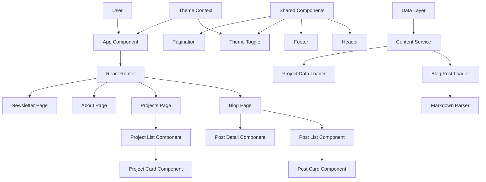
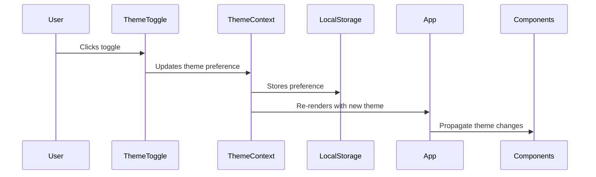
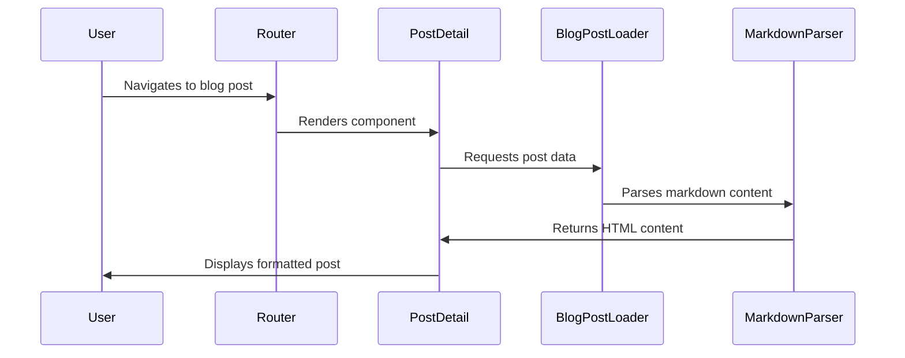
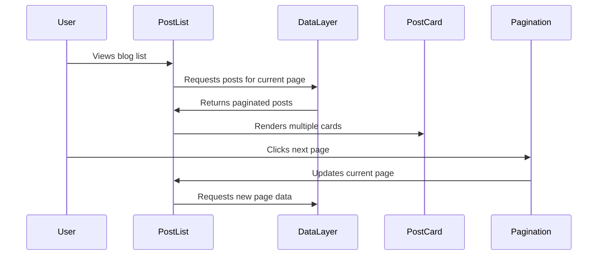

# System Patterns: Personal Blog

## System Architecture

## Key Technical Decisions

### Content Management

- **Markdown-based Content**: Blog posts will be written in Markdown and stored in the repository
- **Frontmatter for Metadata**: Each post will include frontmatter for title, date, tags, etc.
- **Static JSON for Projects**: Project data will be stored in JSON files for simplicity
- **Content Service Abstraction**: Data access layer to isolate content fetching logic
- **Database Migration Path**: Design enables future switch from files to database without UI changes

### Component Architecture

- **Component-Based Design**: UI broken down into reusable, composable components
- **Container/Presentation Pattern**: Separate data handling from UI rendering
- **Context API for Global State**: Theme preferences and potentially other global states

### Routing

- **Client-Side Routing**: Using React Router for navigation without page reloads
- **Path-Based Routes**: Clean URL structure (/blog, /projects, /about, etc.)
- **Dynamic Routes**: Support for dynamic paths like /blog/:slug for individual posts

### Performance Considerations

- **Code Splitting**: Lazy loading components to reduce initial bundle size
- **Image Optimization**: Properly sized and compressed images for posts
- **Memoization**: Strategic use of React.memo and useMemo for expensive operations

## Design Patterns in Use

### Component Patterns

- **Compound Components**: For related component groups
- **Render Props/Hooks**: For shared component logic
- **Higher-Order Components**: Where appropriate for cross-cutting concerns

### State Management

- **Context + Reducers**: For more complex state (if needed)
- **Local Component State**: For component-specific UI state
- **Custom Hooks**: To encapsulate and reuse state logic

### Data Flow

- **Unidirectional Data Flow**: Parent-to-child props passing
- **Events Up, Data Down**: Child components emit events, parents pass data
- **Async Data Handling**: Loading states and error boundaries for data fetching

## Critical Implementation Paths

### Theme Switching

### Content Rendering

### Pagination

