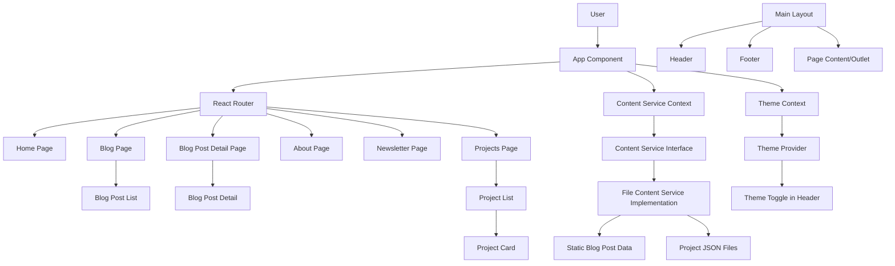
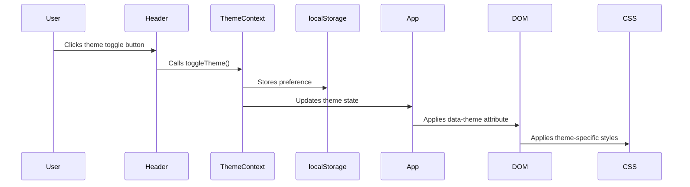
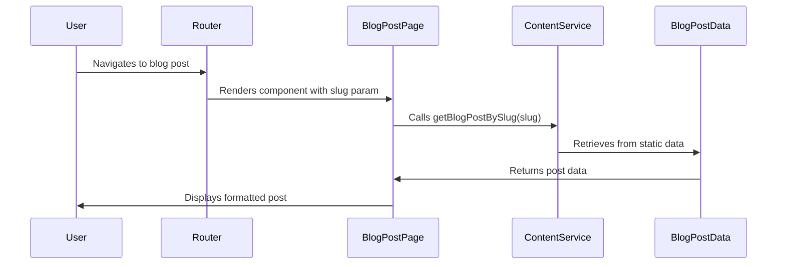
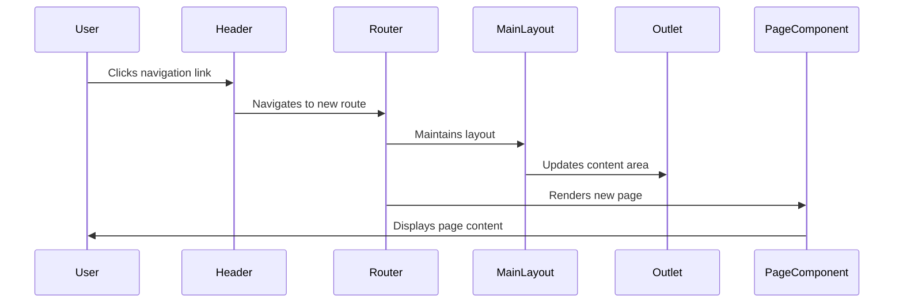

# System Patterns: Personal Blog

## System Architecture

## Key Technical Decisions

### Content Management

- **Static TypeScript Data**: Blog posts now stored in TypeScript files as arrays of objects
- **JSON for Projects**: Project data stored in JSON files
- **Content Service Abstraction**: Data access layer isolates content fetching logic
- **Database Migration Path**: Interface-based design enables future switch to API/database

### Component Architecture

- **Component-Based Design**: UI broken down into reusable, composable components
- **Container/Presentation Pattern**: Separation of data handling from UI rendering
- **Context API for Global State**: Theme preferences and content service abstraction

### Routing

- **Client-Side Routing**: React Router v6 for navigation without page reloads
- **Nested Routes with Outlet**: All routes use MainLayout as parent
- **Path-Based Routes**: Clean URL structure (/blog, /projects, /about, etc.)
- **Dynamic Routes**: Support for dynamic paths like /blog/:slug for individual posts

### Performance Considerations

- **Component Memoization**: React.memo and useMemo used for expensive operations
- **Lazy Loading**: Pages load only when navigated to
- **Responsive Design**: Efficient styling for all devices

## Design Patterns in Use

### Component Patterns

- **Compound Components**: Related component groups working together
- **Custom Hooks**: For encapsulated logic like useTheme and useContentService
- **Context Providers**: For global state management

### State Management

- **Context + State Hooks**: For theme and content service management
- **Local Component State**: For component-specific UI state
- **Custom Hooks**: To encapsulate and reuse state logic

### Data Flow

- **Unidirectional Data Flow**: Parent-to-child props passing
- **Context for Global State**: Theme and content service provided globally
- **Async Data Handling**: Loading states for data fetching operations

## Critical Implementation Paths

### Theme Switching

### Content Rendering

### Page Navigation

