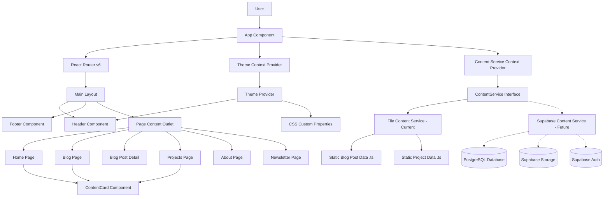
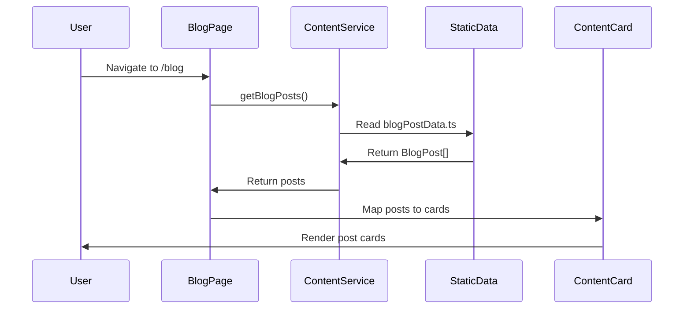
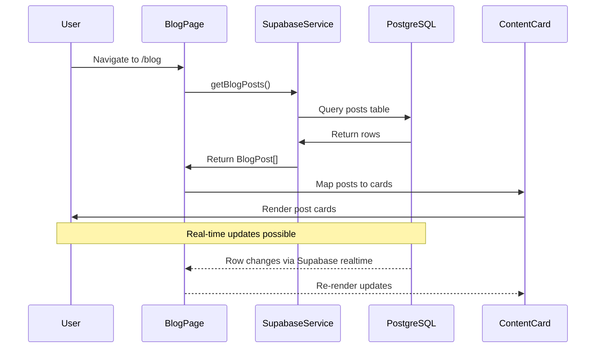

# System Patterns: Personal Blog

## System Architecture (Current State)



## Key Technical Decisions & Patterns

### **Content Management Pattern (Current → Future)**

#### Current Pattern (Static Data)

```typescript
// Static TypeScript data approach
export const blogPosts: BlogPost[] = [
  {
    id: "1",
    title: "Sample Post",
    slug: "sample-post",
    content: "Static content...",
    // ... other fields
  },
];

// Service abstraction
class FileContentService implements ContentService {
  async getBlogPosts(): Promise<BlogPost[]> {
    return blogPosts; // Returns static data
  }
}
```

#### Future Pattern (Supabase Integration)

```typescript
// Supabase/PostgreSQL integration
class SupabaseContentService implements ContentService {
  private supabase: SupabaseClient;

  async getBlogPosts(): Promise<BlogPost[]> {
    const { data, error } = await this.supabase
      .from("posts")
      .select("*")
      .eq("published", true)
      .order("date", { ascending: false });

    if (error) throw error;
    return data;
  }

  async createBlogPost(post: CreateBlogPost): Promise<void> {
    const { error } = await this.supabase.from("posts").insert([post]);

    if (error) throw error;
  }
}
```

### **Component Architecture Pattern**

#### Unified ContentCard System

```typescript
// Single component handles all content types
interface ContentCardProps {
  title: string;
  date?: string;        // For blog posts
  image?: string;       // coverImage or imageUrl
  excerpt?: string;     // excerpt or description
  tags?: string[];      // common across types
  slug?: string;        // For navigation links
  links?: {            // For projects
    github?: string;
    demo?: string;
  };
  className?: string;   // Layout-specific styling
  linkPrefix?: string;  // "/blog/" or "/projects/"
}

// Usage across different contexts
<ContentCard {...blogPost} className="recent-post-main" />
<ContentCard {...project} className="project-card-row-2" links={project.links} />
```

### **CSS Architecture Pattern (Post-Refactoring)**

#### Organized CSS Structure

```css
/* 1. CSS Variables & Root Styles - Global theming */
:root {
  --bg-primary: #ffffff;
  --text-primary: #333333;
  /* ... theme variables */
}

/* 2. Global Styles - Typography, buttons, links */
/* 3. Layout Components - Header, footer, navigation */
/* 4. Common Components - ContentCard, pagination */
/* 5. Page-Specific Styles - Blog grids, project layouts */
/* 6. Utility Classes - Tags, helpers */
/* 7. Responsive Design - Mobile, tablet breakpoints */
```

#### Component-CSS Mapping Pattern

```typescript
// CSS classes map to component props
const getLayoutClass = (index: number) => {
  return [
    "recent-post-card", // Base component style
    index === 0 ? "recent-post-main" : "", // Layout-specific style
    index === 1 || index === 2 ? "recent-post-secondary" : "",
    index === 3 ? "recent-post-fourth" : "",
  ]
    .filter(Boolean)
    .join(" ");
};
```

### **Theme Management Pattern**

#### Context-Based Theme System

```typescript
// Theme detection hierarchy
const ThemeProvider = ({ children }) => {
  const [theme, setTheme] = useState(() => {
    // 1. Check localStorage (user preference)
    const saved = localStorage.getItem("theme");
    if (saved) return saved;

    // 2. Check system preference
    if (window.matchMedia("(prefers-color-scheme: dark)").matches) {
      return "dark";
    }

    // 3. Default to light
    return "light";
  });

  // Apply theme to DOM
  useEffect(() => {
    document.documentElement.setAttribute("data-theme", theme);
    localStorage.setItem("theme", theme);
  }, [theme]);
};
```

#### CSS Custom Properties Integration

```css
/* Light mode (default) */
:root {
  --bg-primary: #ffffff;
  --text-primary: #333333;
}

/* Dark mode override */
[data-theme="dark"] {
  --bg-primary: #121212;
  --text-primary: #ffffff;
}

/* Components use variables */
.content-card {
  background-color: var(--bg-primary);
  color: var(--text-primary);
}
```

## Critical Implementation Patterns

### **Routing Pattern (React Router v6)**

#### Nested Route Structure

```typescript
function App() {
  return (
    <Router>
      <Routes>
        <Route path="/" element={<MainLayout />}>
          <Route index element={<HomePage />} />
          <Route path="blog" element={<BlogPage />} />
          <Route path="blog/:slug" element={<BlogPostPage />} />
          <Route path="projects" element={<ProjectsPage />} />
          <Route path="about" element={<AboutPage />} />
          <Route path="newsletter" element={<NewsletterPage />} />
          <Route path="*" element={<NotFound />} />
        </Route>
      </Routes>
    </Router>
  );
}
```

#### Navigation with Active States

```typescript
// Header navigation with active link detection
const Header = () => {
  const location = useLocation();

  const isActiveLink = (path: string) => {
    return (
      location.pathname === path || location.pathname.startsWith(path + "/")
    );
  };

  return (
    <nav>
      <Link
        to="/blog"
        className={`nav-link ${isActiveLink("/blog") ? "active" : ""}`}
      >
        Blog
      </Link>
    </nav>
  );
};
```

### **Data Flow Pattern**

#### Current Flow (Static Data)



#### Future Flow (Supabase Integration)



### **Admin Content Management Pattern (Planned)**

#### Simple Form-Based Admin

```typescript
// Basic admin interface pattern
const AdminPostForm = () => {
  const [post, setPost] = useState<CreateBlogPost>({
    title: "",
    slug: "",
    excerpt: "",
    content: "", // Markdown
    coverImage: null,
    tags: [],
    published: false,
  });

  const handleSubmit = async (e: FormEvent) => {
    e.preventDefault();

    // 1. Upload image to Firebase Storage
    const imageUrl = await uploadImage(post.coverImage);

    // 2. Save post to Firestore
    await contentService.createBlogPost({
      ...post,
      coverImage: imageUrl,
      date: new Date(),
      author: "Admin",
    });

    // 3. Redirect or show success
  };
};
```

#### Authentication Pattern

```typescript
// Supabase Auth integration
const useAuth = () => {
  const [session, setSession] = useState(null);
  const [loading, setLoading] = useState(true);

  useEffect(() => {
    supabase.auth.getSession().then(({ data: { session } }) => {
      setSession(session);
      setLoading(false);
    });

    const {
      data: { subscription },
    } = supabase.auth.onAuthStateChange((_event, session) => {
      setSession(session);
    });

    return () => subscription.unsubscribe();
  }, []);

  return {
    session,
    user: session?.user,
    loading,
    isAdmin: session?.user?.email === "admin@example.com",
  };
};
```

## Performance Patterns

### **Component Optimization Pattern**

#### Memoization Strategy

```typescript
// Memoize expensive operations
const BlogPage = () => {
  const posts = useContentService().getBlogPosts();

  // Memoize filtered/sorted posts
  const recentPosts = useMemo(() => posts.slice(0, 4), [posts]);

  const paginatedPosts = useMemo(
    () => posts.slice(startIndex, startIndex + postsPerPage),
    [posts, startIndex, postsPerPage]
  );
};

// Memoize ContentCard to prevent unnecessary re-renders
export default memo(ContentCard);
```

#### Code Splitting Pattern (Future)

```typescript
// Lazy load admin components
const AdminDashboard = lazy(() => import("./AdminDashboard"));
const MarkdownEditor = lazy(() => import("./MarkdownEditor"));

// Route-based code splitting
const App = () => (
  <Suspense fallback={<Loading />}>
    <Routes>
      <Route path="/admin/*" element={<AdminDashboard />} />
    </Routes>
  </Suspense>
);
```

### **Image Optimization Pattern (Planned)**

#### Supabase Storage Integration

```typescript
// Image upload with optimization
const uploadOptimizedImage = async (file: File) => {
  // 1. Client-side compression
  const compressedFile = await compressImage(file, {
    maxWidth: 1200,
    maxHeight: 800,
    quality: 0.8,
  });

  // 2. Upload to Supabase Storage
  const fileExt = compressedFile.name.split(".").pop();
  const fileName = `${Date.now()}.${fileExt}`;
  const filePath = `images/${fileName}`;

  const { data, error } = await supabase.storage
    .from("blog-images")
    .upload(filePath, compressedFile);

  if (error) throw error;

  // 3. Get public URL
  const {
    data: { publicUrl },
  } = supabase.storage.from("blog-images").getPublicUrl(filePath);

  return publicUrl;
};
```

## Mobile Responsiveness Patterns (Critical Fix Needed)

### **Current Issue Pattern**

```css
/* Current problematic pattern */
@media (max-width: 768px) {
  .header-content {
    flex-direction: column; /* Causes layout issues */
  }

  .recent-posts-grid {
    grid-template-columns: 1fr; /* Too simplistic */
  }
}
```

### **Improved Mobile Pattern (Planned)**

```css
/* Mobile-first approach */
.header-content {
  display: flex;
  flex-direction: column;
  gap: 1rem;
}

/* Progressive enhancement for larger screens */
@media (min-width: 768px) {
  .header-content {
    flex-direction: row;
    justify-content: space-between;
    align-items: center;
  }
}

/* Touch-optimized interactions */
@media (max-width: 768px) {
  .nav-link {
    min-height: 44px; /* Touch target size */
    padding: 0.75rem 1rem;
  }

  .content-card {
    margin-bottom: 1rem;
    /* Ensure proper spacing on mobile */
  }
}
```

## Error Handling Patterns

### **Graceful Degradation Pattern**

```typescript
// Content loading with fallbacks
const BlogPage = () => {
  const [posts, setPosts] = useState<BlogPost[]>([]);
  const [loading, setLoading] = useState(true);
  const [error, setError] = useState<string | null>(null);

  useEffect(() => {
    const fetchPosts = async () => {
      try {
        const fetchedPosts = await contentService.getBlogPosts();
        setPosts(fetchedPosts);
      } catch (err) {
        setError("Failed to load posts");
        console.error("Error fetching posts:", err);
      } finally {
        setLoading(false);
      }
    };

    fetchPosts();
  }, []);

  if (loading) return <LoadingSpinner />;
  if (error) return <ErrorMessage message={error} />;
  if (posts.length === 0) return <EmptyState message="No posts found" />;

  return <PostsList posts={posts} />;
};
```

### **Supabase Error Handling Pattern (Planned)**

```typescript
// Supabase-specific error handling
const handleSupabaseError = (error: PostgrestError) => {
  switch (error.code) {
    case "23505": // unique_violation
      return "This content already exists";
    case "42501": // insufficient_privilege
      return "You do not have permission to perform this action";
    case "42P01": // undefined_table
      return "The requested resource was not found";
    case "08P01": // protocol_violation
      return "Service temporarily unavailable. Please try again.";
    default:
      return `Database error: ${error.message}`;
  }
};
```

## Migration Strategy Pattern

### **Gradual Migration Approach**

```typescript
// Service abstraction allows gradual migration
class HybridContentService implements ContentService {
  private supabaseService: SupabaseContentService;
  private fileService: FileContentService;
  private useSupabase: boolean;

  constructor() {
    this.useSupabase = process.env.NODE_ENV === "production";
  }

  async getBlogPosts(): Promise<BlogPost[]> {
    if (this.useSupabase) {
      try {
        return await this.supabaseService.getBlogPosts();
      } catch (error) {
        // Fallback to static data
        console.warn("Supabase unavailable, using static data");
        return await this.fileService.getBlogPosts();
      }
    }

    return await this.fileService.getBlogPosts();
  }
}
```

This architecture supports seamless migration from static data to Firebase while maintaining system stability and developer productivity.
